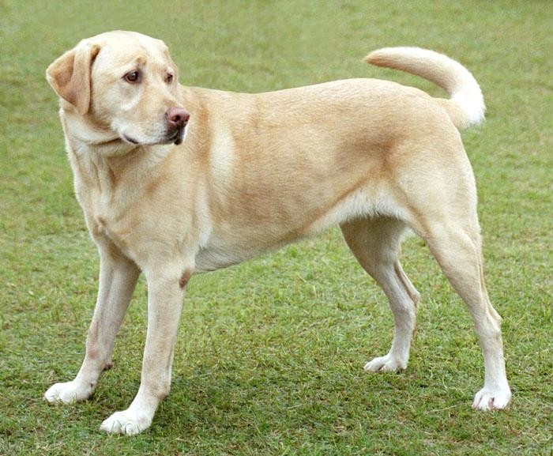
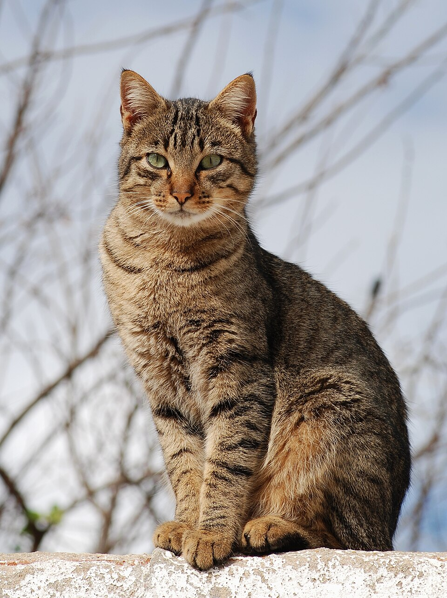
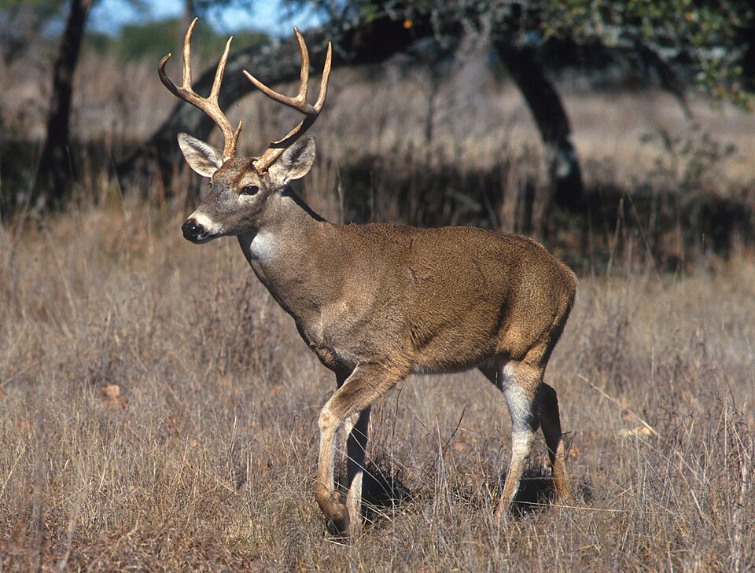
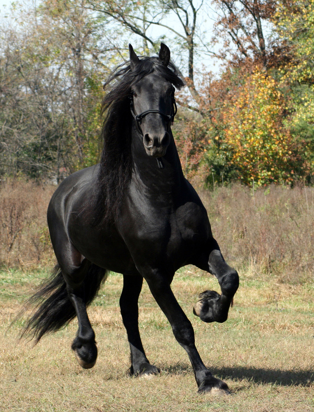
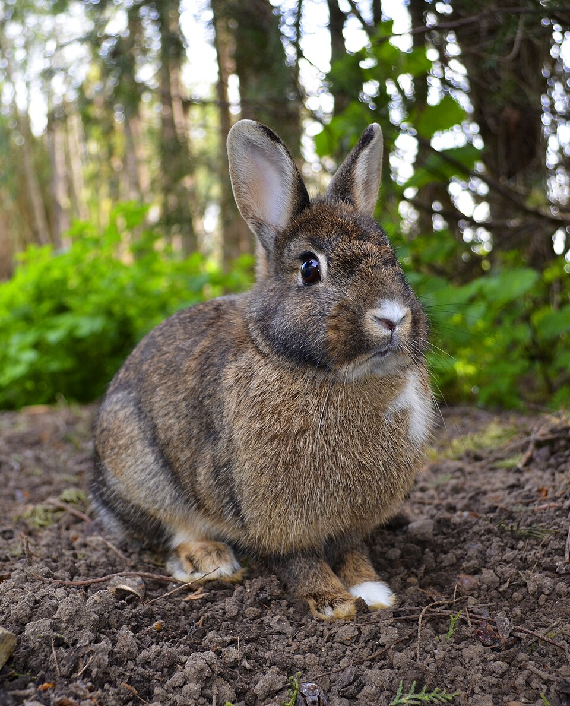
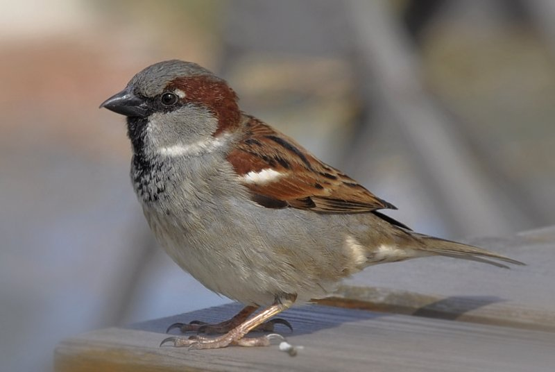
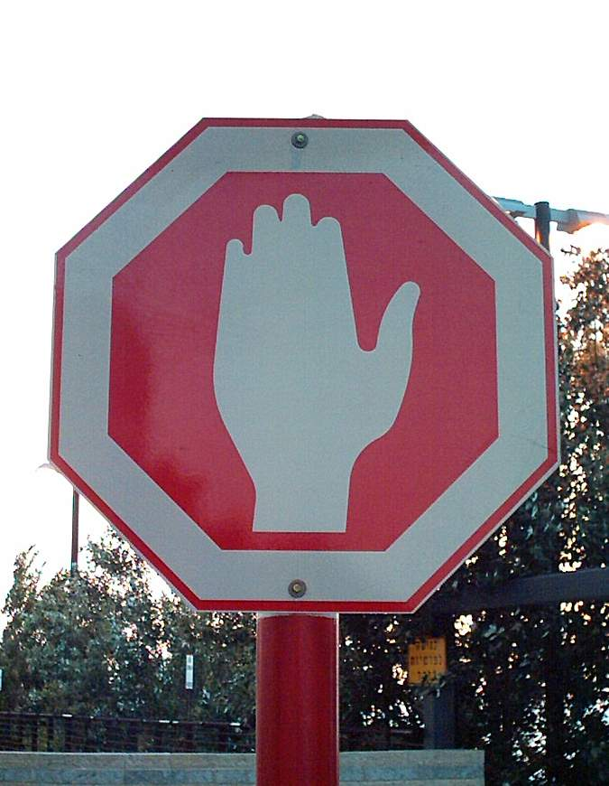

# Visual probabilities with DiffusionGemma

This fork explores **image in → probabilities over predefined answers** using
DiffusionGemma and vLLM. Supply an image and a question schema; get a distribution
for each question without generating a prose answer.

It builds on [vLLM PR #57250](https://github.com/vllm-project/vllm/pull/57250),
inspired by [TypeSafe's Jev](https://typesafe.ai/blog/introducing-system-one-models-and-jev).
This is an independent experiment using DiffusionGemma, with no Jev weights or
calibration training. The original vLLM README follows below.

## What works

- A Python client for local images and boolean, choice, or ordered-score questions.
- Multiple answer slots scored in a diffusion step, with per-question probabilities
  and the underlying diagnostics preserved.
- A labelled-image evaluation runner reporting accuracy, Brier score, log loss,
  calibration error, threshold coverage, and request latency.
- A Vast.ai bootstrap, synthetic image fixtures, and scoped teardown helper.

## Real photographs: animals and visual questions

Tested on 19 September 2026 with **DiffusionGemma 26B-A4B NVFP4 on one RTX 5090
(32 GB)**. Each animal photo was sent with **24 questions**, including a species
question offering **all 24 classes** from `wm_animals/animal_taxonomy.json`.
The taxonomy supplies labels; the exact question wording below was written for
this experiment. One sample, no generated thought, eager execution, canvas 64.

### Animal results

Displayed percentages are rounded; `100.00%` does not mean certainty.

| Photo | Species: highest score | Coat colour | Posture |
| --- | --- | --- | --- |
|  | dog (100.00%) | tan_cream (99.95%) | standing (55.42%) |
|  | cat (99.97%) | brown (70.19%) | sitting (99.88%) |
|  | fox (99.99%) | red_ginger (52.23%) | lying (99.52%) |
|  | deer (99.98%) | brown (96.07%) | standing (58.54%) |
|  | horse (99.97%) | black (99.99%) | walking_running (99.90%) |
|  | rabbit_hare (99.97%) | brown (86.86%) | sitting (99.56%) |
|  | bird (99.95%) | other (99.80%) | sitting (46.21%) |

Species: **7/7 correct**. Across the 43 pre-labelled animal decisions: **95.3% accuracy**.
All 24 distributions are retained; the scored subset covers species, colour,
posture, outdoors, visible people, multiple animals, and the cat coat pattern.

### Asking other questions

The same interface handles general visual questions with predefined answers.
These two photos each received the same eight-question schema.

| Photo | Question | Highest-scoring answer | Expected |
| --- | --- | --- | --- |
|  | What is the main object? | drink (100.00%) | drink |
| — | Is a real animal visible? | no (100.00%) | no |
| — | Is a real person visible? | no (100.00%) | no |
| — | Is a cup visible? | yes (100.00%) | yes |
| — | Is a spoon visible? | yes (100.00%) | yes |
| — | What shape is the main road sign? | no_sign (100.00%) | no_sign |
| — | Is a hand symbol visible? | no (100.00%) | no |
| — | Is the literal word STOP visible? | no (100.00%) | no |
|  | What is the main object? | traffic_sign (99.86%) | traffic_sign |
| — | Is a real animal visible? | no (100.00%) | no |
| — | Is a real person visible? | no (100.00%) | no |
| — | Is a cup visible? | no (100.00%) | no |
| — | Is a spoon visible? | no (100.00%) | no |
| — | What shape is the main road sign? | octagon (99.61%) | octagon |
| — | Is a hand symbol visible? | yes (100.00%) | yes |
| — | Is the literal word STOP visible? | no (99.07%) | no |

The stop sign contains a hand symbol rather than the word STOP. These are
separate questions, so both can be answered without generating or parsing prose.

### Mistakes and confidence

These are convenience examples, not a representative accuracy or calibration
benchmark. They may have appeared in training data. Expected labels were fixed
by visual inspection before inference; ambiguous animal context attributes were
left unscored. A high normalized score is not a guarantee of correctness.

| Photo | Question | Prediction | Expected |
| --- | --- | --- | --- |
| bird | posture | sitting (46.21%) | standing |
| bird | outdoors | no (80.71%) | yes |

### Exact animal prompts

Shared task: **Inspect the supplied photograph. Judge only visible evidence.**

| Question ID | Prompt | Allowed answers |
| --- | --- | --- |
| `species` | Classify the main animal. Use other for an animal outside the listed classes; unknown if no animal or not identifiable. | dog, cat, fox, raccoon, opossum, skunk, coyote, badger, hedgehog, squirrel, rabbit_hare, rodent, deer, wild_boar, bear, big_cat, monkey_primate, kangaroo, horse, livestock, bird, reptile, other, unknown |
| `coat_colour` | What is the predominant coat colour? Use other for feathers or scales. | black, white, gray, tan_cream, brown, red_ginger, other |
| `coat_pattern` | What is the coat pattern? Use other for feathers or scales. | solid, bicolour, tabby_striped, spotted, patched, merle, brindle, other |
| `posture` | What is the main animal doing? | standing, sitting, lying, walking_running, climbing_jumping, other |
| `view` | From which direction is the main animal body viewed? | front, front_three_quarter, side, rear_three_quarter, rear, top, other, unknown |
| `has_collar` | Is a collar visibly present around the animal neck? | yes, no |
| `has_harness` | Is a body harness visibly present? | yes, no |
| `on_leash` | Is the animal visibly attached to a leash? | yes, no |
| `tethered_or_tied` | Is the animal visibly tethered or tied to a fixed object? | yes, no |
| `has_ear_tag` | Is an ear tag visible? | yes, no |
| `muzzled` | Is the animal wearing a muzzle? | yes, no |
| `wearing_service_or_working_vest` | Is the animal wearing a service or working vest? | yes, no |
| `wearing_coat_or_clothing` | Is the animal wearing clothing or a coat? | yes, no |
| `saddled_or_ridden` | Is the animal saddled or being ridden? | yes, no |
| `carrying_object_or_prey` | Is the animal carrying an object or prey? | yes, no |
| `is_juvenile` | Does the animal visibly appear juvenile? | yes, no |
| `not_truncated` | Is the entire animal inside the image boundaries? | yes, no |
| `not_occluded` | Is the animal free of substantial occlusion by other objects? | yes, no |
| `sharpness` | Is the animal sharp enough to see fine detail? | yes, no |
| `exposure` | Is the animal exposed well enough to see its features? | yes, no |
| `species_legibility` | Is the animal species visually identifiable? | yes, no |
| `outdoors` | Is the scene outdoors? | yes, no |
| `visible_people` | Is any real person visible? | yes, no |
| `multiple_animals` | Are multiple real animals visible? | yes, no |

Complete schemas: [animals](examples/features/diffusion_reads/evaluation/animal_schema.json), [general questions](examples/features/diffusion_reads/evaluation/generic_schema.json).
The table above lists all animal prompt wording; the general-question table
lists all eight general prompts. General choice options are `animal`, `drink`,
`traffic_sign`, `other` for main object, and `octagon`, `triangle`, `circle`,
`rectangle`, `no_sign` for sign shape. All other general questions use yes/no.

### How the output works

**Every question gets its own distribution.** We do not select one winning
question. Species options compete with each other, but collar, outdoors, and
other yes/no questions can all be true at the same time. To detect both dogs and
cats in one image, use separate presence questions instead of a single species
choice. This prototype does not return boxes or identify individual animals.

The adapter assigns answer tokens to each question, reads their log
probabilities at that answer slot, and normalizes over that question’s allowed
tokens. Taking the maximum is a display/decision policy; the full distribution
is available. Shared prompts mean the questions are not statistically independent.

Example request using the exact tested schema:

```python
import json
import sys
from pathlib import Path

sys.path.insert(0, "examples/features/diffusion_reads")
from visual_client import read_image

root = Path("examples/features/diffusion_reads/evaluation")
schema = json.loads((root / "animal_schema.json").read_text())
result = read_image(root / "images/dog.jpg", schema, "http://127.0.0.1:8011")
print(json.dumps(result["probabilities"], indent=2))
```

Actual dog output excerpt (rounded to six decimal places; all species options
are shown, followed by three additional questions):

```json
{
  "species": {
    "dog": 0.999982,
    "cat": 4e-06,
    "fox": 2e-06,
    "raccoon": 3e-06,
    "opossum": 0.0,
    "skunk": 1e-06,
    "coyote": 1e-06,
    "badger": 0.0,
    "hedgehog": 0.0,
    "squirrel": 0.0,
    "rabbit_hare": 0.0,
    "rodent": 5e-06,
    "deer": 0.0,
    "wild_boar": 0.0,
    "bear": 0.0,
    "big_cat": 0.0,
    "monkey_primate": 0.0,
    "kangaroo": 0.0,
    "horse": 0.0,
    "livestock": 0.0,
    "bird": 0.0,
    "reptile": 0.0,
    "other": 0.0,
    "unknown": 0.0
  },
  "has_collar": {
    "yes": 0.0,
    "no": 1.0
  },
  "outdoors": {
    "yes": 1.0,
    "no": 0.0
  },
  "multiple_animals": {
    "yes": 6.2e-05,
    "no": 0.999938
  }
}
```

The response also includes `latency_ms`, `usage`, and `diagnostics`. Diagnostics
retain `label_mass` (the original vocabulary probability assigned to the allowed
answers), `argmax_is_label`, entropy, chunk membership, and read count.
Very low label mass can coexist with a very high normalized answer score.

### What do multiple questions cost?

Rental price: **$0.82778/hour including allocated storage**. Warm sequential
benchmark: dog and cat, five measured repetitions per photo and question count,
12 excluded warmups, shuffled order, 60 measured requests. Existing prefix and
image caches were enabled; these are repeated images, not unseen-image throughput.

| Questions per image | Reads | Mean server time | Mean HTTP time | Server-time $ / 1,000 images | Server-time $ / 1,000 answers |
| --- | --- | --- | --- | --- | --- |
| 1 | 1 | 133.4 ms | 948.3 ms | $0.0307 | $0.0307 |
| 2 | 1 | 136.5 ms | 960.8 ms | $0.0314 | $0.0157 |
| 4 | 1 | 150.2 ms | 1012.9 ms | $0.0345 | $0.0086 |
| 8 | 1 | 172.2 ms | 1501.3 ms | $0.0396 | $0.0049 |
| 16 | 3 | 347.9 ms | 1332.1 ms | $0.0800 | $0.0050 |
| 24 | 3 | 373.0 ms | 1500.3 ms | $0.0858 | $0.0036 |

Cost formula: `mean_server_ms × hourly_USD / 3600` gives dollars per 1,000
images; divide again by question count for dollars per 1,000 answers. This
estimates occupied server time at concurrency one. It is not a provider quote
or a throughput-optimized production price. Adapter timing is not a CUDA timer;
HTTP timing also includes photo upload and the SSH round trip.

The provider bills the entire rental lifetime, including installation, model
download, idle time, and teardown; bandwidth can be extra. The table excludes
those costs. Question length, option count, canvas capacity, image resolution,
batching, and cache state all matter. See the raw benchmark for p50/p95 and
every request’s diagnostics.

### Grouped versus separate requests

For the same 24 questions on the dog and cat:

| Delivery | Mean server time per image | Mean HTTP time per image |
| --- | --- | --- |
| One grouped request (three reads) | 373.0 ms | 1500.3 ms |
| 24 separate requests | 3097.8 ms | 20172.5 ms |

Grouping used about **8.3× less server time** in this small comparison.
The separate sweep ran once per photo after the main benchmark, so cache
histories differ; this is not a controlled throughput claim. Repeated photo
uploads also make the separate HTTP path much slower.
[All separate-request outputs](examples/features/diffusion_reads/evaluation/separate-results.json).

Eight questions cost about 1.3× the server time of one here; 24 cost about 2.8×.
The increase is not linear: 1–8 questions fit one read, while these named
16- and 24-question schemas require three reads with canvas 64. Within a read,
answer slots are scored together. Prompt length and canvas work still increase;
additional questions are not universally free.

### Does grouping, sampling, or option order change answers?

| Configuration | Species accuracy | Scored decisions | Pooled accuracy | Median HTTP latency |
| --- | --- | --- | --- | --- |
| 24 questions, 1 sample | 7/7 | 43 | 95.3% | 3833.4 ms |
| Species only, 1 sample | 7/7 | 7 | 100.0% | 1029.5 ms |
| Species only, reversed options | 7/7 | 7 | 100.0% | 1099.8 ms |
| 24 questions, 4 samples | 7/7 | 43 | 97.7% | 3383.1 ms |

These small checks are descriptive. The configurations have different scored
question sets and cache histories, and the first main-suite request may include
cold startup work. Four samples are not a guarantee of better calibration or
accuracy. Reversing options changes the answer-token mapping as well as order.
Here, four samples corrected the bird outdoors answer, but still labelled its
posture sitting. Species remained correct under all tested configurations.

The larger named schema exposed a tokenization bug in the original compact
answer format. This fork keeps `id: label` delimiters for named questions; the
GPU results above include that fix. Numeric IDs can still use compact formatting.

### Rental and teardown

The instance was destroyed after **21.4 minutes**; the account had
**zero remaining instances** when checked. Time at the quoted rate was about
**$0.29**. The observed credit decrease was **$0.35**,
including any charges reflected by that snapshot; final billing may lag.

Setup included model download and a roughly 5.6-minute CUDA kernel rebuild,
despite restoring a previous kernel cache. Reusing a cache archive is therefore
not a guarantee of instant startup. The per-image cost table excludes this setup
and all idle time. A local two-hour cleanup timer was armed before rental and
disarmed only after deletion was confirmed.

### Reproduce and inspect everything

```bash
uv pip install pybase64
.venv/bin/python examples/features/diffusion_reads/visual_client.py \
    --schema examples/features/diffusion_reads/evaluation/animal_schema.json \
    --manifest examples/features/diffusion_reads/evaluation/animals.jsonl \
    --endpoint http://127.0.0.1:8011
.venv/bin/python examples/features/diffusion_reads/evaluation/benchmark.py \
    --endpoint http://127.0.0.1:8011 --hourly-usd 0.8277777778 \
    --output benchmark-results.json
```

- [Full animal outputs and metrics](examples/features/diffusion_reads/evaluation/animals-results.json)
- [Full general-question outputs and metrics](examples/features/diffusion_reads/evaluation/generic-results.json)
- [All benchmark requests, timing, and probabilities](examples/features/diffusion_reads/evaluation/benchmark-results.json)
- [Sampling and option-order comparisons](examples/features/diffusion_reads/evaluation/comparison-results.json)
- [Methodology and additional commands](examples/features/diffusion_reads/evaluation/README.md)
- [Exact model revision, adapter hash, hardware, and settings](examples/features/diffusion_reads/evaluation/run.json)
- [Photo creators and licenses](examples/features/diffusion_reads/evaluation/ATTRIBUTION.md)
- [Download URLs and image checksums](examples/features/diffusion_reads/evaluation/sources.json)

## First GPU smoke test

On a **32 GB RTX 5090**, using NVIDIA's NVFP4 DiffusionGemma checkpoint, all six
answers were correct across three solid-colour images. Each request asked for
the colour and whether the image was red, using one sample and no generated thought.

| Image | Probability assigned to correct colour | End-to-end latency |
| --- | --- | --- |
| Red | 99.94% | 6.89 s (first request) |
| Green | 99.86% | 0.467 s |
| Blue | 96.57% | 0.500 s |

These are three synthetic smoke-test requests over an SSH tunnel, using eager
execution. They establish a working image-to-probabilities path;
calibrated confidence and representative production performance remain to be evaluated.

**The scores are normalized over the allowed answer tokens.** For the blue image,
those tokens collectively held only 1.9% of the original vocabulary probability,
even though the normalized blue score was 96.57%. A high score alone should not
be treated as a reliable probability of correctness.

[Recorded results](examples/features/diffusion_reads/vast/smoke-results.json) ·
[GPU setup and findings](examples/features/diffusion_reads/vast/README.md)

## Try it

Start the patched model server and structured adapter using the
[setup instructions](examples/features/diffusion_reads/README.md#visual-probabilities-prototype),
then send an image with the supplied screenshot schema:

```bash
.venv/bin/python examples/features/diffusion_reads/visual_client.py \
    --image screenshot.png \
    --schema examples/features/diffusion_reads/visual_schema.json \
    --endpoint http://127.0.0.1:8011
```

Install the client dependency with `uv pip install pybase64`. Model serving requires a
suitable GPU and this fork's code. The first cloud run exposed missing Python
headers and build tools, now included in the bootstrap; FlashInfer also needed
an initial kernel compilation. See the GPU runbook for optional cache reuse.

For evaluation on your own labelled images, see the
[manifest format and metrics](examples/features/diffusion_reads/README.md#evaluate-labelled-images).

---

<!-- markdownlint-disable MD001 MD041 -->
<p align="center">
  <picture>
    <source media="(prefers-color-scheme: dark)" srcset="https://raw.githubusercontent.com/vllm-project/vllm/main/docs/assets/logos/vllm-logo-text-dark.png">
    
  </picture>
</p>

<h3 align="center">
Easy, fast, and cheap LLM serving for everyone
</h3>

<p align="center">
| <a href="https://docs.vllm.ai"><b>Documentation</b></a> | <a href="https://blog.vllm.ai/"><b>Blog</b></a> | <a href="https://arxiv.org/abs/2309.06180"><b>Paper</b></a> | <a href="https://x.com/vllm_project"><b>Twitter/X</b></a> | <a href="https://discuss.vllm.ai"><b>User Forum</b></a> | <a href="https://slack.vllm.ai"><b>Developer Slack</b></a> |
</p>

🔥 We have built a vLLM website to help you get started with vLLM. Please visit [vllm.ai](https://vllm.ai) to learn more.
For events, please visit [vllm.ai/events](https://vllm.ai/events) to join us.

---

## About

vLLM is a fast and easy-to-use library for LLM inference and serving.

Originally developed in the [Sky Computing Lab](https://sky.cs.berkeley.edu) at UC Berkeley, vLLM has grown into one of the most active open-source AI projects built and maintained by a diverse community of many dozens of academic institutions and companies from over 2000 contributors.

vLLM is fast with:

- State-of-the-art serving throughput
- Efficient management of attention key and value memory with [**PagedAttention**](https://blog.vllm.ai/2023/06/20/vllm.html)
- Continuous batching of incoming requests, chunked prefill, prefix caching
- Fast and flexible model execution with piecewise and full CUDA/HIP graphs
- Quantization: FP8, MXFP8/MXFP4, NVFP4, INT8, INT4, GPTQ/AWQ, GGUF, compressed-tensors, ModelOpt, TorchAO, and [more](https://docs.vllm.ai/en/latest/features/quantization/index.html)
- Optimized attention kernels including FlashAttention, FlashInfer, TRTLLM-GEN, FlashMLA, and Triton
- Optimized GEMM/MoE kernels for various precisions using CUTLASS, TRTLLM-GEN, CuTeDSL
- Speculative decoding including n-gram, suffix, EAGLE, DFlash
- Automatic kernel generation and graph-level transformations using torch.compile
- Disaggregated prefill, decode, and encode

vLLM is flexible and easy to use with:

- Seamless integration with popular Hugging Face models
- High-throughput serving with various decoding algorithms, including *parallel sampling*, *beam search*, and more
- Tensor, pipeline, data, expert, and context parallelism for distributed inference
- Streaming outputs
- Generation of structured outputs using xgrammar or guidance
- Tool calling and reasoning parsers
- OpenAI-compatible API server, plus Anthropic Messages API and gRPC support
- Efficient multi-LoRA support for dense and MoE layers
- Support for NVIDIA GPUs, AMD GPUs, Intel GPUs, and x86/ARM/PowerPC CPUs. Additionally, diverse hardware plugins such as Google TPUs, Intel Gaudi, IBM Spyre, Huawei Ascend, Rebellions NPU, Apple Silicon, MetaX GPU, and more.

vLLM seamlessly supports 200+ model architectures on Hugging Face, including:

- Decoder-only LLMs (e.g., Llama, Qwen, Gemma)
- Mixture-of-Expert LLMs (e.g., Mixtral, DeepSeek-V3, Qwen-MoE, GPT-OSS)
- Hybrid attention and state-space models (e.g., Mamba, Qwen3.5)
- Multi-modal models (e.g., LLaVA, Qwen-VL, Pixtral)
- Embedding and retrieval models (e.g., E5-Mistral, GTE, ColBERT)
- Reward and classification models (e.g., Qwen-Math)

Find the full list of supported models [here](https://docs.vllm.ai/en/latest/models/supported_models.html).

## Getting Started

Install vLLM with [`uv`](https://docs.astral.sh/uv/) (recommended) or `pip`:

```bash
uv pip install vllm
```

Or [build from source](https://docs.vllm.ai/en/latest/getting_started/installation/gpu/index.html#build-wheel-from-source) for development.

Visit our [documentation](https://docs.vllm.ai/en/latest/) to learn more.

- [Installation](https://docs.vllm.ai/en/latest/getting_started/installation.html)
- [Quickstart](https://docs.vllm.ai/en/latest/getting_started/quickstart.html)
- [List of Supported Models](https://docs.vllm.ai/en/latest/models/supported_models.html)

## Contributing

We welcome and value any contributions and collaborations.
Please check out [Contributing to vLLM](https://docs.vllm.ai/en/latest/contributing/index.html) for how to get involved.

## Citation

If you use vLLM for your research, please cite our [paper](https://arxiv.org/abs/2309.06180):

```bibtex
@inproceedings{kwon2023efficient,
  title={Efficient Memory Management for Large Language Model Serving with PagedAttention},
  author={Woosuk Kwon and Zhuohan Li and Siyuan Zhuang and Ying Sheng and Lianmin Zheng and Cody Hao Yu and Joseph E. Gonzalez and Hao Zhang and Ion Stoica},
  booktitle={Proceedings of the ACM SIGOPS 29th Symposium on Operating Systems Principles},
  year={2023}
}
```

## Contact Us

<!-- --8<-- [start:contact-us] -->
- For technical questions and feature requests, please use GitHub [Issues](https://github.com/vllm-project/vllm/issues)
- For discussing with fellow users, please use the [vLLM Forum](https://discuss.vllm.ai)
- For coordinating contributions and development, please use [Slack](https://slack.vllm.ai)
- For security disclosures, please use GitHub's [Security Advisories](https://github.com/vllm-project/vllm/security/advisories) feature
- For collaborations and partnerships, please contact us at [collaboration@vllm.ai](mailto:collaboration@vllm.ai)
<!-- --8<-- [end:contact-us] -->

## Media Kit

- If you wish to use vLLM's logo, please refer to [our media kit repo](https://github.com/vllm-project/media-kit)
